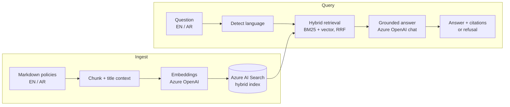
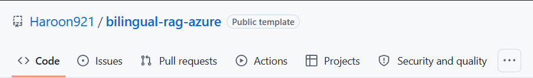
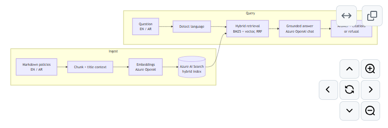

# Bilingual Enterprise RAG (Arabic + English) on Azure

A grounded, cited, **evaluated** question-answering service over enterprise policy documents in
Arabic and English, built on **Azure OpenAI** and **Azure AI Search**.

> Personal project built on a synthetic, fictional corpus. Views and design choices are my own.

[](https://github.com/Haroon921/bilingual-rag-azure/generate)
[](https://codespaces.new/Haroon921/bilingual-rag-azure)
[](https://github.com/Haroon921/bilingual-rag-azure/actions/workflows/tests.yml)

## Why this exists

Most enterprise GenAI pilots don't stall at the demo. They stall on the questions the demo skips:

- Does it **refuse** when the documents don't contain the answer, instead of guessing?
- Does it work in the **users' language**, including when the source is in another language?
- Can you **measure** quality, and catch regressions when a prompt or model changes?
- Is it **secure by default**: keyless auth, untrusted-content handling, input limits?

This repo is a small, complete answer to those four questions, not a chatbot demo.

## What it does

- Answers in the **language of the question** (Arabic or English), with `[n]` citations to source passages
- **Cross-language retrieval**: an Arabic question finds an English-only policy, and vice versa
- **Refuses** out-of-scope questions with a fixed sentence in the user's language
- Ships an **evaluation harness** (retrieval, fact accuracy, refusal behaviour, groundedness, latency, tokens)
- **Keyless** auth via Microsoft Entra ID by default

## Architecture



| Layer | Choice |
|---|---|
| Retrieval | Azure AI Search **hybrid** (keyword + vector, fused with RRF) |
| Lexical analysis | `ar.microsoft` and `en.microsoft` analyzers on separate per-language fields |
| Embeddings | Multilingual `text-embedding-3-large` (3072 dims, configurable) |
| Generation | Azure OpenAI chat deployment (`gpt-4o` by default, configurable) |
| API | FastAPI (`/ask`, `/health`) and a CLI |
| Auth | `DefaultAzureCredential` (Entra ID); API keys are an optional fallback |

## Design decisions

- **Hybrid search, not vector-only.** Exact terms (`VPN`, `BitLocker`, `SAR 1,200`) are won by BM25;
  paraphrases and cross-language matches are won by vectors. RRF combines both without score tuning.
- **Per-language lexical fields.** Arabic morphology needs the Arabic analyzer; English needs its own.
  Each chunk is indexed into the field matching its language, and the query searches both.
- **Cross-language by design.** The corpus deliberately includes an English-only document and an
  Arabic-only document, and the eval set asks about each in the *other* language.
- **Refuse rather than guess.** The prompt requires one exact refusal sentence per language; the app
  also refuses without calling the LLM when retrieval returns nothing. Refusals are measured, not assumed.
- **Sources are untrusted.** The system prompt tells the model to ignore instructions inside retrieved
  text or the question (a basic prompt-injection defence, not a complete one).
- **Contextual chunks.** The document title is prepended before embedding so short chunks keep context.
- **Keyless by default.** No secrets in `.env` when you `az login`.
- **Offline-testable core.** Chunking, language detection, normalisation, metrics and the full
  `ask()` flow (with fake clients) are covered by unit tests that need no Azure access.

## Quickstart

Requires Python 3.10+ and an Azure subscription. See [`docs/azure-setup.md`](docs/azure-setup.md).

```bash
python -m venv .venv && source .venv/bin/activate
pip install -r requirements-dev.txt
cp .env.example .env            # fill in your endpoints and deployment names
az login                        # Entra ID auth (or set API keys in .env)

python -m src.ingest --recreate # build the index and load the sample corpus
python -m src.cli "How many days of annual leave do I get?"
python -m src.cli "ما الحد الأدنى لطول كلمة المرور؟"     # Arabic question, Arabic-only source
python -m src.cli "What is the hotel limit for international travel?"

uvicorn src.app:app --reload    # POST /ask {"question": "..."}
pytest -q                       # offline unit tests (no Azure needed)
```

### Explore the API interactively

Create a repository from this template, open it in GitHub Codespaces, and run:

```bash
uvicorn src.app:app --host 0.0.0.0 --port 8000
```

Open the forwarded port and visit `/docs` for the interactive OpenAPI explorer. The `/health`
endpoint and API schema work without Azure configuration. To call `/ask`, complete the Azure setup,
copy `.env.example` to `.env`, and ingest the sample documents first.

## Screenshots

### Public template repository



### Rendered architecture



## Evaluation

```bash
python -m evals.run_eval --judge
```

The 14-question set in [`evals/questions.jsonl`](evals/questions.jsonl) covers:

| Slice | Count | What it tests |
|---|---|---|
| English, same-language source | 5 | baseline retrieval and answering |
| Arabic, same-language source | 4 | Arabic retrieval, Arabic answers, Arabic digit handling |
| Cross-language | 2 | English question → Arabic-only doc, Arabic question → English-only doc |
| Multi-document | 1 | answer needs the remote-work and IT-security policies |
| Out-of-scope | 3 | must refuse (English and Arabic) |

Metrics: retrieval hit rate, fact accuracy (normalised for Arabic-Indic digits and thousands
separators), false-refusal rate, correct-refusal rate, LLM-judged groundedness, p50/p95 latency,
and token usage.

### Results

Run it against your own deployment and paste the numbers here (they depend on your model, region and
index), for example:

| Metric | Result |
|---|---|
| Retrieval hit rate | _run it_ |
| Fact accuracy (EN / AR) | _run it_ |
| Correct refusal rate | _run it_ |
| False refusal rate | _run it_ |
| Groundedness (`--judge`) | _run it_ |
| Latency p50 / p95 | _run it_ |

The set is small and synthetic, so treat results as a regression guard, not a benchmark.

## Production considerations (what I'd do next with a real customer)

- **Security trimming.** Store ACL/group IDs on each chunk and filter every query by the caller's
  identity, so users only retrieve what they are allowed to read.
- **Reranking.** Add Azure AI Search semantic ranker and use its score for a calibrated
  "not enough evidence" threshold; RRF scores are not comparable across queries.
- **Safety layers.** Azure AI Content Safety and Prompt Shields in front of the model, plus output checks.
- **Networking and identity.** Private endpoints, managed identity, API Management in front of `/ask`,
  authentication on the API (the demo has none).
- **Observability.** Application Insights for retrieval hits, refusals, latency, token cost and user feedback.
- **Eval in CI.** Human-labelled questions from real users, run on every prompt/model/index change.
- **Arabic depth.** Dialect handling, query normalisation (hamza/alef variants), and evaluation with
  native-speaker reviewers.
- **Data pipeline.** Incremental indexing with deletion of stale chunks, and support for PDFs/Office files.

## Known limitations

- Refusal relies on the model following the prompt. It is measured by the eval, not guaranteed.
- The corpus and questions are synthetic and small.
- `--recreate` is needed after changing the embedding model or dimensions; re-ingesting a shrunken
  document without it leaves stale chunks.
- Arabic sample text should be reviewed by a native speaker before being used in any real setting.

## Repo layout

```
src/
  text_utils.py   language detection, chunking, normalisation   (pure, tested)
  documents.py    corpus loading and chunking                   (pure, tested)
  prompts.py      system prompt, refusal detection              (pure, tested)
  ingest.py       index schema + embedding + upload
  rag.py          hybrid retrieval and grounded answering
  app.py / cli.py FastAPI service and command line
evals/            question set, metrics, live eval runner
tests/            27 offline tests (incl. fake-client end-to-end)
data/sample_docs/ fictional bilingual policies
docs/             Azure setup
```

## License

MIT. See [`LICENSE`](LICENSE).
